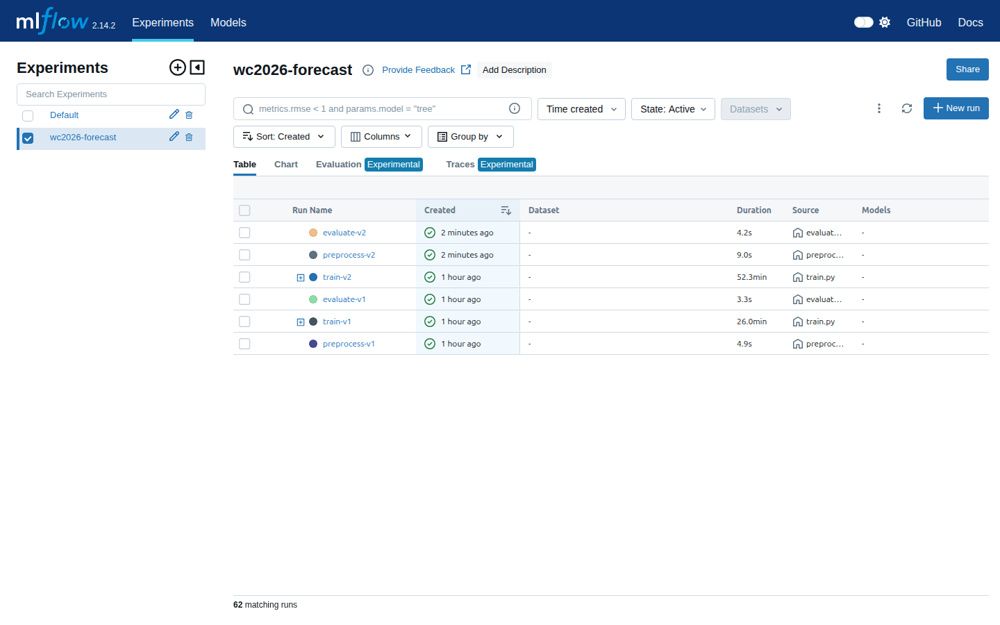
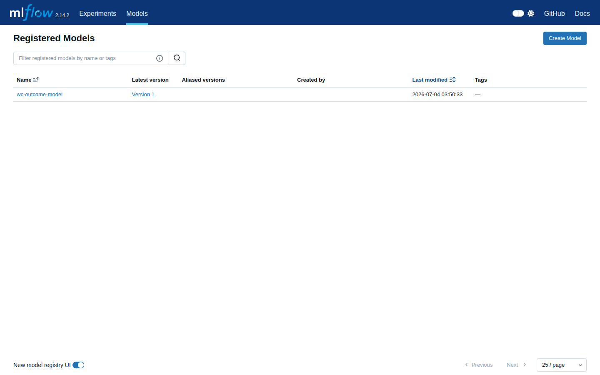
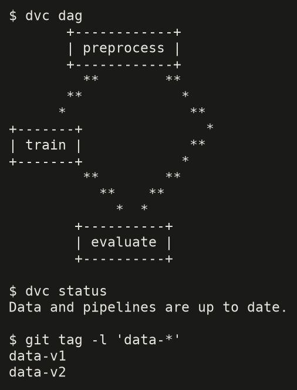
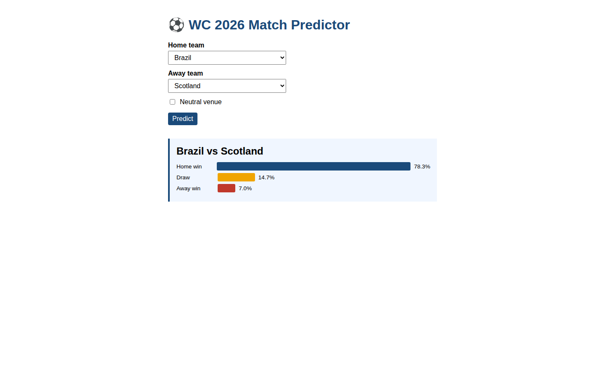

# WC 2026 Forecasting — MLOps Pipeline

End-to-end MLOps project for the **MLOps & Model Deployment** module (SupNum, Master DEML M1, Prof. Yehdhih ANNA). It wraps a probabilistic football match-outcome forecaster in a full production stack: **experiment tracking + model registry (MLflow on EC2), reproducible data/model versioning (DVC + S3), and a deployed prediction service (Flask on EC2)**, backed by a collaborative Git workflow.

> **Selection philosophy:** the best model is chosen by **log loss + calibration**, not accuracy. Reliable probabilities matter more than raw hit-rate for an intrinsically noisy sport.

---

## Access links

| Resource | URL |
|---|---|
| Flask app (predictions) | `http://3.21.66.2:8000` |
| MLflow UI (experiments + registry) | `http://18.190.116.80:5000` |
| GitHub repository | `https://github.com/Lavdal-Yahya/wc2026-mlops` |

**Team:** Mouhamedou Yahya Cheikh Med Vall (25239) · Mounaa Mahfoudh (22074) · Mohamed Dhmin (22040) · Souleymane Baba (22018)

---

## 1. Problem & dataset

**Task.** Predict the outcome of an international football match as **calibrated probabilities** over three classes, from the home team's perspective: `away_win (0)`, `draw (1)`, `home_win (2)`. Multiclass classification — not a single-winner prediction.

**Data.** Public *International football results* dataset (Kaggle, `martj42`), international matches since 1872. Features are **engineered from history with strict temporal causality** (no post-match information leaks in):

- **Elo** — relative team strength, updated match by match.
- **Rolling form** — goals scored/conceded and win rate over the last *N* matches.
- **Head-to-head** — historical record between the two teams.

**Why log loss over accuracy.** The three candidate models are statistically tied on accuracy; probability quality is the discriminator. We select on mean log loss under **time-aware cross-validation** (expanding window), controlling Brier score and calibration.

### Model comparison

The pipeline trains and compares the three models on the same time-aware split (test from 2023-01-01), with a uniform baseline (log loss `ln 3 ≈ 1.099`) as reference. Log loss, Brier, accuracy and macro F1 are logged to MLflow per run (see the MLflow link above). The lowest-log-loss model is promoted to the Model Registry as `wc-outcome-model` and served directly by the app.

---

## 2. Technical architecture

```
                        ┌──────────────────────────┐
                        │        GitHub Repo        │
                        │  main ← dev ← feat/*      │
                        │  1 branch/member, PRs     │
                        └────────────┬─────────────┘
                                     │ code + dvc.yaml + params.yaml
                                     ▼
 ┌─────────────┐   dvc push/pull   ┌──────────────────────┐
 │  Amazon S3   │◄─────────────────│  DVC pipeline         │
 │  bucket      │                  │  preprocess → train   │
 │  - raw/      │   artifacts      │  → evaluate           │
 │  - processed/│◄───────────┐     └────────┬─────────────┘
 │  - models/   │            │              │ mlflow logging
 └─────────────┘            │              ▼
                     ┌───────┴──────────────────────┐
                     │  EC2 #1 — MLflow Tracking     │
                     │  server + Model Registry      │
                     │  (sqlite backend, S3 artifacts)│
                     └───────┬──────────────────────┘
                             │ latest registered model + ratings snapshot
                             ▼
                     ┌──────────────────────────────┐
                     │  EC2 #2 — Flask app           │
                     │  home/away dropdowns + neutral │
                     │  → P(win / draw / loss)        │
                     └──────────────────────────────┘
```

- **GitHub & collaboration.** One personal branch per member, convention `feat/<topic>-<owner>` (`feat/preprocess-souleyman`, `feat/mouna-preprocess-train`, `feat/flask-serving-mohamed`, `feat/infra-flask-lavdal`), merged via PRs into `dev` then `main`. Non-linear history (5 merges); ≥ 3 meaningful commits per member.
- **Amazon S3.** Single bucket as shared store: `raw/` (raw data), `processed/` (processed data + ratings snapshot), `models/` (DVC-versioned artifacts). Doubles as the DVC remote and MLflow artifact store.
- **DVC — reproducible pipeline.** Three stages in `dvc.yaml` (`preprocess → train → evaluate`); all params centralized in `params.yaml` (`seed = 42`). **Two interchangeable data versions**: **v1** (Elo-only features) and **v2** (v1 + rolling form + head-to-head), switchable via `git checkout` + `dvc checkout`.
- **MLflow (EC2 #1).** Tracking server logging hyperparameters, metrics (log loss, Brier, accuracy, macro F1) and artifacts per run. **Only the best model** (lowest log loss) is promoted to the Model Registry as `wc-outcome-model`.
- **Flask (EC2 #2).** Loads the latest registered model plus the **ratings snapshot** (latest Elo + form per team). User picks two teams; the feature vector is rebuilt server-side exactly as at training time, and outcome probabilities are returned.

---

## 3. Reproduce

### Prerequisites
- Python 3.10+, AWS CLI configured, DVC with S3 support, a running MLflow tracking server.
- Kaggle credentials at `~/.kaggle/kaggle.json` (`chmod 600`).

### Environment
```bash
git clone https://github.com/Lavdal-Yahya/wc2026-mlops.git
cd wc2026-mlops
python3 -m venv .venv && source .venv/bin/activate
pip install -r requirements.txt
cp .env.example .env      # set MLFLOW_TRACKING_URI + AWS vars
```

### Pull data & models (DVC)
```bash
dvc pull                  # fetch data + artifacts from the S3 remote
```

### Run the pipeline
```bash
dvc repro                 # preprocess → train → evaluate, logged to MLflow
```

### Switch data versions
```bash
git checkout data-v1 && dvc checkout     # Elo-only features (v1)
git checkout data-v2 && dvc checkout     # + rolling + h2h (v2)
```

### Serve the app locally
```bash
export MLFLOW_TRACKING_URI=http://18.190.116.80:5000
python app/app.py         # or: gunicorn -b 0.0.0.0:8000 app.app:app
```

---

## 4. Repository layout

```
wc2026-mlops/
├── data/                  # DVC-tracked (raw/, processed/)
├── src/                   # data/, features/ (elo,rolling,h2h,build), models/, evaluation/, simulation/
├── scripts/               # preprocess.py · train.py · evaluate.py  (MLflow-instrumented)
├── app/                   # app.py + templates/index.html
├── dvc.yaml               # pipeline: preprocess → train → evaluate
├── params.yaml            # single source of params (seed = 42)
├── requirements.txt
├── .env.example
└── README.md
```

---

## 5. Screenshots

**MLflow — experiment history (62 runs, v1 + v2):**



**MLflow — Model Registry (only the best model, `wc-outcome-model`):**



**DVC — 3-stage pipeline + switchable data versions:**



**Flask — live prediction:**



---

## 6. Non-negotiables

- Time-aware validation only (expanding window) — no random splits.
- No leakage — every feature uses pre-match information only.
- Always report Accuracy, Macro F1, Log Loss, Brier, calibration.
- Logistic Regression baseline in every comparison.
- Only the best model is registered.

## 7. Team contributions

| Member | Mat. | Branch | Scope |
|---|---|---|---|
| Mouhamedou Yahya Cheikh Med Vall | 25239 | `feat/infra-flask-lavdal` | Repo, AWS (S3/IAM/EC2), MLflow server, DVC wiring, integration |
| Souleymane Baba | 22018 | `feat/preprocess-souleyman`, `feat/evaluate-dvc-souleyman` | Preprocessing, feature build, evaluation/DVC |
| Mohamed Dhmin | 22040 | `feat/flask-serving-mohamed` | Flask serving app |
| Mounaa Mahfoudh | 22074 | `feat/mouna-preprocess-train` | Preprocessing, training (LR/RF/GB), MLflow logging |
